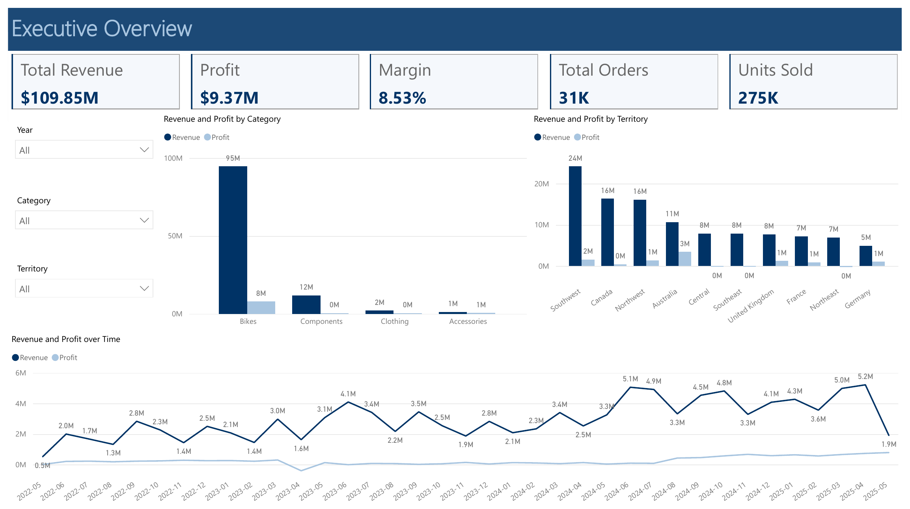
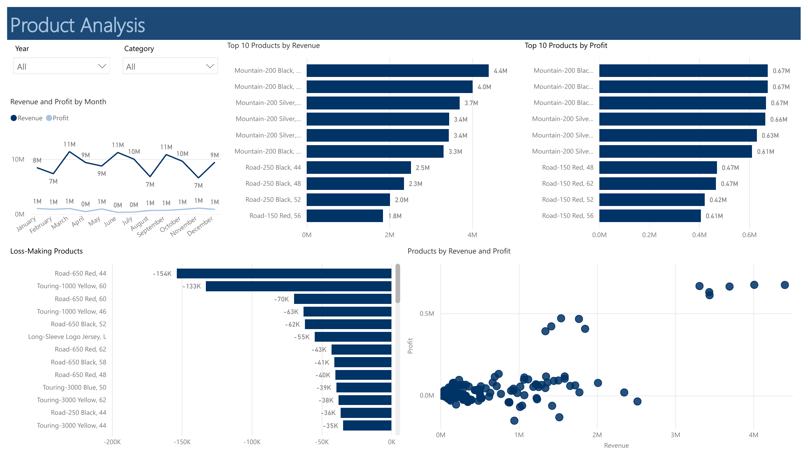
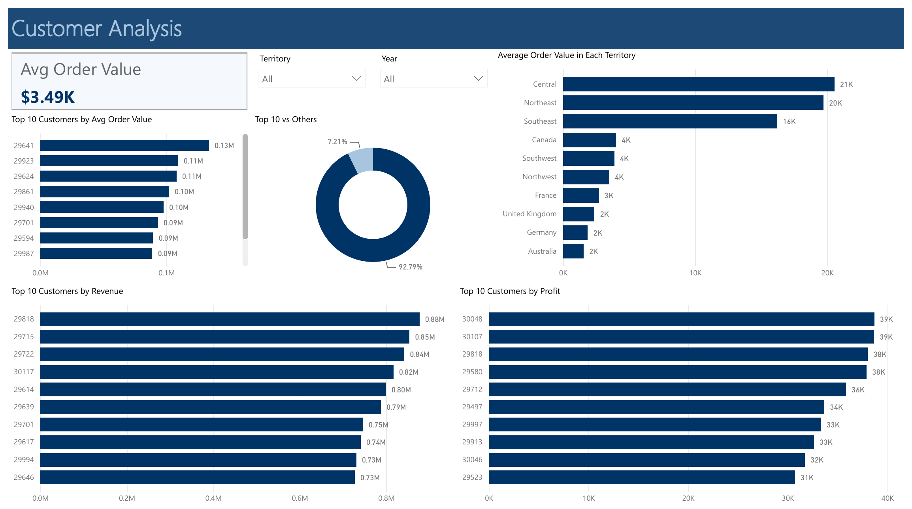
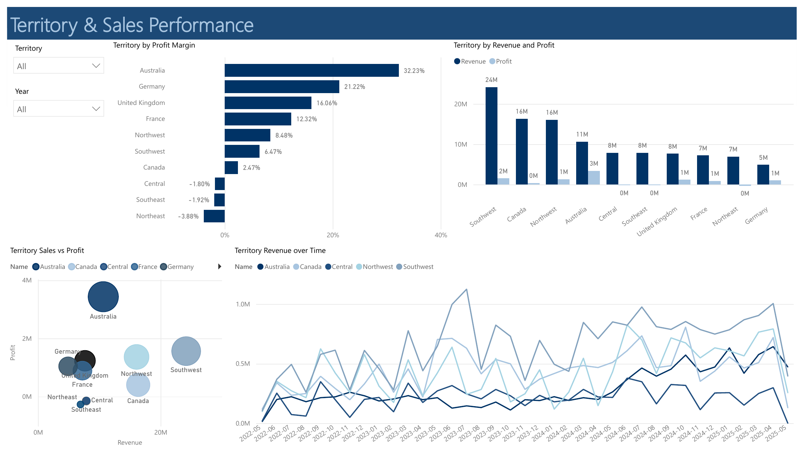

# AdventureWorks Sales & Customer Analytics | SQL Server + Power BI

## Overview
End-to-end analysis of the **AdventureWorks 2025** database. I used **Microsoft SQL Server (T-SQL)** to check data quality and calculate business KPIs, then built a 4-page interactive **Power BI** dashboard to present the results.

The analysis covers **$109.8M in revenue** and answers where the business makes (and loses) money across products, customers, regions and discounts.

## Business Questions
- How is the business performing overall (revenue, cost, profit, margin)?
- Which categories and products generate the most revenue and profit?
- Who are the top customers, and how dependent is the business on them?
- Which territories perform best?
- Do discounts help or hurt profit?
- How do sales and profit change month over month?

## Tools Used
- **Microsoft SQL Server (T-SQL):** CTEs, window functions (`DENSE_RANK`, `ROW_NUMBER`, `LAG`), joins, aggregations, data quality checks
- **Power BI:** data modeling, DAX, interactive visuals

## Process
1. **Data quality checks:** row counts, duplicates, nulls, valid ranges, and referential integrity across all tables used
2. **KPI analysis:** revenue, cost, profit, and margin by category, subcategory, product, customer, territory, discount, and month
3. **Advanced analysis:** customer ranking with cumulative revenue share, product profitability, month-over-month growth
4. **Dashboard:** built in Power BI to explore the results interactively

## Key Insights

| Metric | Result |
|---|---|
| Total revenue | $109.85M |
| Total profit | $9.37M |
| Profit margin | 8.53% |
| Total orders | 31K |
| Units sold | 275K |

- **Bikes drive the business.** Bikes are the top category by both revenue ($94.65M, about 86% of total) and profit ($7.94M, about 85% of total).
- **One product line leads.** *Mountain-200 Black, 38* is the top product by revenue ($4.40M), and *Mountain-200 Black, 42* is the top product by profit ($674K).
- **Bigger orders do not mean more profit.** Central has the highest average order value ($20.5K) but a negative margin. Discounts are not the cause: only about 4% of its revenue is discounted.
- **The customer base is diversified.** The top 10 customers account for only 7.2% of revenue, so the business does not depend on a few large accounts.
- **Top regions differ by metric.** Southwest (Territory 4) has the highest revenue ($24.18M), but Australia (Territory 9) has the highest profit ($3.43M). The biggest market is not the most profitable one.
- **Discounted sales had negative profit overall** (about -$1.05M combined), while full-price sales earned $10.42M profit on $102.37M revenue. Since reseller orders also have negative margins, part of this effect likely overlaps with the channel effect.
- **Revenue peaked in April 2025** at about $5.2M. June 2022 had the highest month-over-month growth, but from a much lower base.

## Recommendations
- Review reseller pricing and discount terms: reseller orders have negative margins in every territory.
- Grow the online channel, which earns about 40% margin everywhere.
- Protect the Bikes category, but look for ways to raise the thin 8.5% overall margin through pricing or cost control.
- Look at why Australia converts revenue to profit better than the largest market, and apply what works elsewhere.

## Dashboard
The Power BI dashboard has four pages:

1. **Executive Overview:** KPIs, revenue and profit by category and territory, and the monthly trend
2. **Product Analysis:** top 10 products by revenue and profit, loss-making products, and revenue vs. profit by product
3. **Customer Analysis:** top 10 customers, their share of total revenue, and average order value by territory
4. **Territory & Sales Performance:** profit margin by territory, revenue and profit by territory, and territory revenue over time






[View the full dashboard as a PDF](powerbi/AdventureWorks_Dashboard.pdf)

## Repository Contents
```
├── sql/
│   ├── 01_data_quality_checks.sql
│   ├── 02_sales_and_product_analysis.sql
│   └── 03_customer_territory_growth_analysis.sql
├── powerbi/
│   └── AdventureWorks_Dashboard.pbix
├── images/
│   └── dashboard screenshots
└── README.md
```

## Notes & Limitations
- Profit is calculated as `LineTotal - (StandardCost × OrderQty)`. `StandardCost` is the product's current standard cost, not the cost at the time of each sale, so profit figures (including the reseller losses) are an approximation.
- Revenue uses `LineTotal`, which is already net of discounts.

## Contact
[ahmed mohamed] | [www.linkedin.com/in/ahmed-mohamed-8a14223b9] | [ahhhhmedelshenhab@gmail.com]
